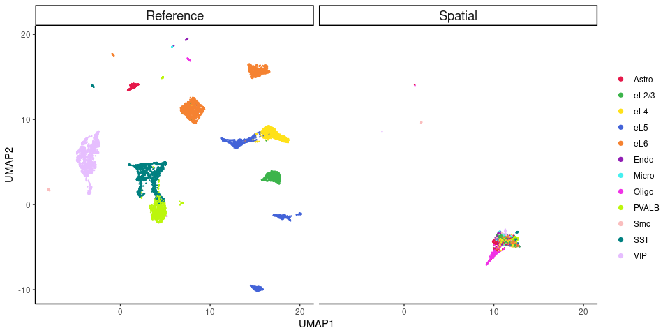
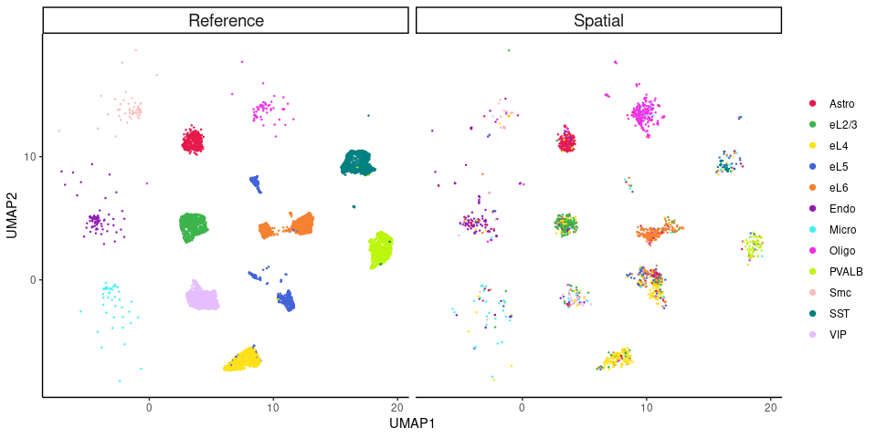
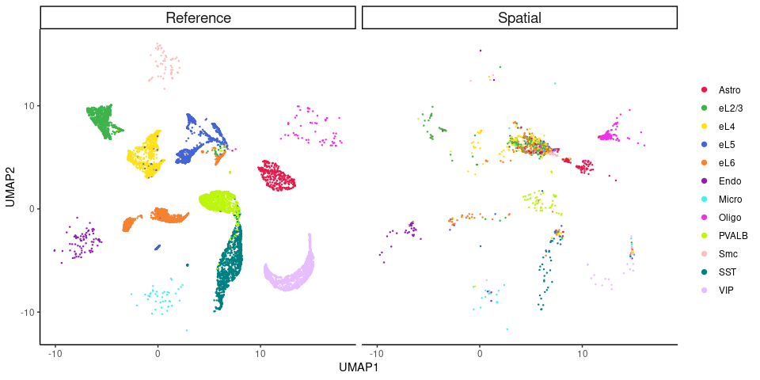
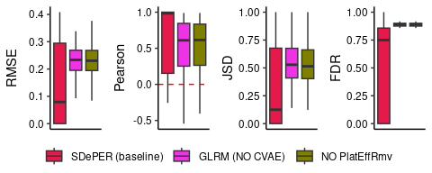

Platform Effect Demonstration
=============================

Last updated: 2024-07-16

This section provides an overview of platform effects, which is defined as systematic difference between scRNA-seq and ST data due to various technical factors, such as differences in protocols, reagents, platforms or simply sequencing depths. Platform effects makes the relationship between ST data and cell type-specific expression profiles from the reference scRNA-seq data **non-linear** and varying across different technologies.

To best demonstrate platform effects, we treat all 2,002 STARmap single cells as "fake" spatial spots and performed cell type deconvolution with an external reference, where platform effects are expected to exist. We ran SDePER with three different settings:

1. Default setting, using **Convolutional Variational Autoencoder** (CVAE) to remove platform effects (see Notebook `SDePER_WITH_CVAE.ipynb <https://github.com/az7jh2/SDePER_Analysis/blob/main/PlatEffDemo/PlatEffDemo_ref_scRNA_SDePER_WITH_CVAE.ipynb>`_).

2. Disabling CVAE in SDePER, then by default SDePER will use an **additive gene-wise platform effects term** instead to account for platform effects in regression (see Notebook `SDePER_NO_CVAE.ipynb <https://github.com/az7jh2/SDePER_Analysis/blob/main/PlatEffDemo/PlatEffDemo_ref_scRNA_SDePER_NO_CVAE.ipynb>`_).

3. Completely **disregarding platform effects**, with no CVAE or additive term used (see Notebook `SDePER_NO_PlatEffRmv.ipynb <https://github.com/az7jh2/SDePER_Analysis/blob/main/PlatEffDemo/PlatEffDemo_ref_scRNA_SDePER_NO_PlatEffRmv.ipynb>`_).

The notebooks detail the description of the notebook, input data (with links to download the data), SDePER settings, running logs, and links to the corresponding results. We then analyze the results and generate images, which are shown below (see Notebook `generate_PlatEffDemo_figures.nb.html <https://rawcdn.githack.com/az7jh2/SDePER_Analysis/36a490c46124fd74ace14542b639a9593024f213/PlatEffDemo/generate_PlatEffDemo_figures.nb.html>`_).

UMAPs of spatial and reference data
-----------------------------------

UMAP based on marker gene expression profiles of spatial data (STARmap cells) and external reference scRNA-seq data are shown in Figure 1, which are colored by the 12 cell types. Significant platform effects observed as in the UMAP, STARmap cells with different cell types are clustering together, and no overlay with scRNA-seq cells.

   Figure 1. UMAP visualizations of spatial and reference data before CVAE transformation

CVAE is a deep generative model that learns the data distribution in a latent space and the generative process to create new data points from this distribution. In SDePER, we use the conditional variable in CVAE to represent the platform (ST or scRNA-seq). When the encoder of CVAE encodes spatial spots and scRNA-seq cells into embeddings in the latent space, **the platform condition is expected to be orthogonal to the latent space**. This means that spatial spots and scRNA-seq cells with similar cell type compositions, and thus similar gene expression profiles, will tend to cluster together in the latent space. This hypothesis is confirmed by the UMAP visualization of the CVAE latent space in Figure 2, where STARmap cells and reference scRNA-seq cells of the same cell type are seen to be close to each other.

   Figure 2. UMAP visualizations of spatial and reference data in CVAE latent space

To remove platform effects, we **transform the gene expression of spatial spots in the ST condition to the scRNA-seq condition**. This is achieved by encoding the spatial spots into the latent space with the conditional variable set to the ST condition, and then decoding them from the latent space with the conditional variable set to the scRNA-seq condition. By applying this CVAE transformation, both spatial and scRNA-seq data are now on the same platform, thus removing platform effects. Figure 3 shows the UMAP visualization of STARmap and reference scRNA-seq cells after CVAE transformation, where cells of the same cell type are close to each other, which is a significant change from the UMAP before CVAE transformation (Figure 1).

   Figure 3. UMAP visualizations of spatial and reference data after CVAE transformation

Performance of cell type deconvolution
--------------------------------------

We compared the cell type deconvolution results of three SDePER settings using metrics including root mean square error (RMSE), Jensen-Shannon Divergence (JSD), Pearson’s correlation coefficient, and false discovery rate (FDR). Figure 4 shows a significant performance improvement when CVAE is activated to remove platform effects. The similar performance of no platform effects removal and platform effects removal via an additive gene-wise term suggests that the complex platform effects cannot be adequately addressed by a simple additive term.

   Figure 4. Performance of cell type deconvolution of three SDePER settings

In conclusion, the CVAE component in SDePER addresses complex platform effects more effectively than a simple additive term and achieves superior performance in cell type deconvolution. Therefore, when platform effects are expected to exist, we recommend activating the CVAE component by setting the option :option:`--use_cvae` to ``true``, which is the default setting of SDePER. This ensures that both spatial and scRNA-seq data are processed on a unified platform, leading to more accurate and reliable cell type deconvolution results.