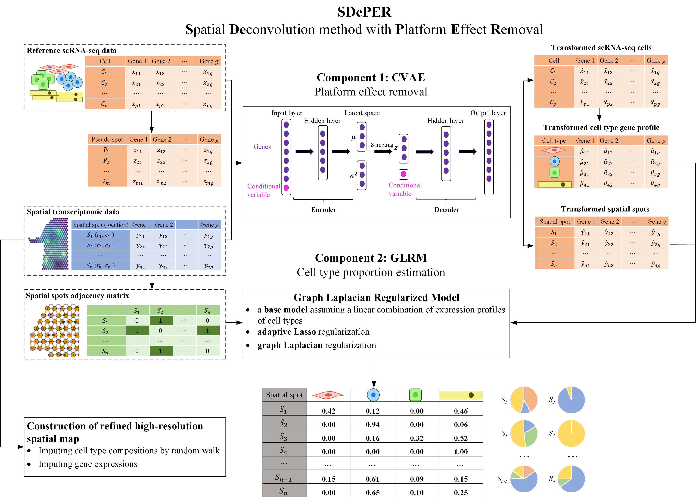

# SDePER
[](https://www.python.org/) [](https://github.com/az7jh2/SDePER) [](https://pypi.org/project/sdeper/) [](https://hub.docker.com/repository/docker/az7jh2/sdeper/general) [](https://sdeper.readthedocs.io/en/latest/)



SDePER (**S**patial **De**convolution method with **P**latform **E**ffect **R**emoval) is a two-step **hybrid** machine learning and regression method considering platform effect, spatial information and sparsity in **deconvolution** of spatial transcriptomic data using reference single-cell RNA sequencing data from same tissue type. It's also able to **impute** cell type compositions and gene expression at **enhanced resolution**.

## Quick Start

SDePER can be installed via `pip`

```bash
conda create -n sdeper-env python=3.9.12
conda activate sdeper-env
pip install sdeper
```

SDePER requires **4 input files** for cell type deconvolution:

1. raw nUMI counts of **spatial transcriptomic data** (spots × genes): `spatial.csv`
2. raw nUMI counts of **reference scRNA-seq data** (cells × genes): `scrna_ref.csv`
3. **cell type annotations** for all cells in scRNA-seq data (cells × 1): `scrna_anno.csv`
4. **adjacency matrix** of spots in spatial transcriptomic data (spots × spots): `adjacency.csv`

To start cell type deconvolution by running

```bash
runDeconvolution -q spatial.csv -r scrna_ref.csv -c scrna_anno.csv -a adjacency.csv
```

**Full Documentation** for SDePER is available on [Read the Docs](https://sdeper.readthedocs.io/en/latest/).

**Example Analysis** with SDePER are available in our GitHub repository [SDePER_Analysis](https://github.com/az7jh2/SDePER_Analysis).
